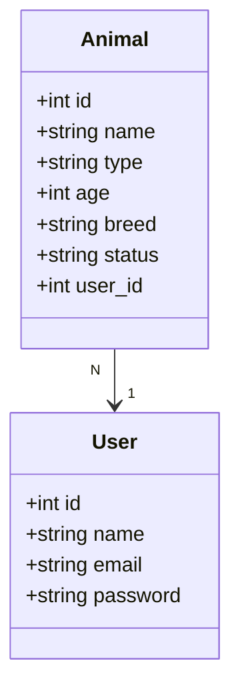

# iDot - Gestão de Adoção de Animais
Aplicação com Spring Boot, Angular e MySQL.

## Diagrama de Classes

```mermaid

classDiagram
    class Animal {
        +int id
        +string name
        +string type
        +int age
        +string breed
        +string status
        +int user_id
    }
    
    class User {
        +int id
        +string name
        +string email
        +string password
    }
    
    Animal "N" --> "1" User

```
